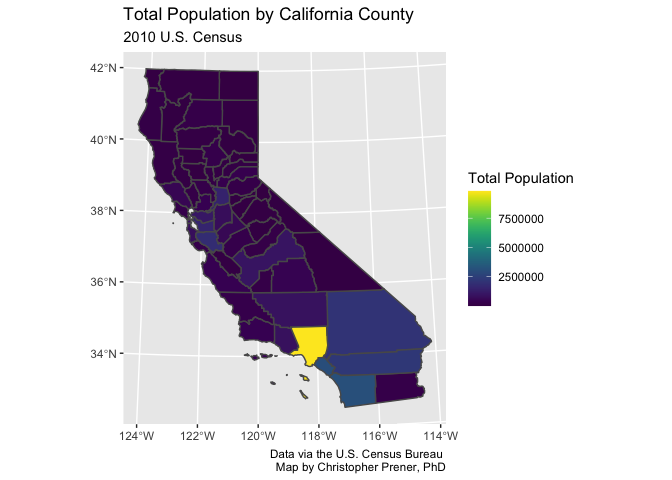
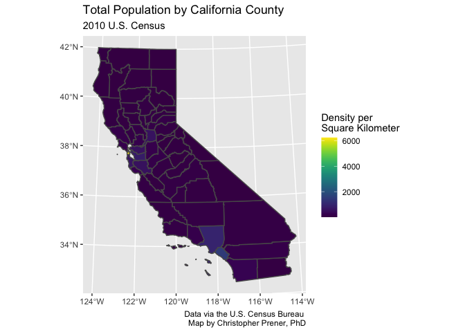

Meeting-02 Meeting Notebook - Complete
================
Christopher Prener, Ph.D.
(February 08, 2021)

## Introduction

This notebook provides a walk-through of the example code used in class.

## Dependencies

This notebook requires the following packages:

``` r
# tidyverse packages
library(ggplot2)       # static mapping

# mapping packages
library(mapview)      # preview spatial data
```

    ## GDAL version >= 3.1.0 | setting mapviewOptions(fgb = TRUE)

``` r
library(sf)           # spatial tools
```

    ## Linking to GEOS 3.8.1, GDAL 3.1.4, PROJ 6.3.1

``` r
# other packages
library(here)         # file path management
```

    ## here() starts at /Users/chris/GitHub/slu-soc5650/content/module-1-basics

``` r
library(viridis)      # viridis color palettes
```

    ## Loading required package: viridisLite

## Load Data

The data for today’s lecture are county-level population estimates from
the 2010 Decennial Census for California. These can be found in
`data/CA_DEMOS_Total_Population`. They are shapefile data:

``` r
cali <- st_read(here("data", "CA_DEMOS_Total_Population", "CA_DEMOS_Total_Population.shp"))
```

    ## Reading layer `CA_DEMOS_Total_Population' from data source `/Users/chris/GitHub/slu-soc5650/content/module-1-basics/data/CA_DEMOS_Total_Population/CA_DEMOS_Total_Population.shp' using driver `ESRI Shapefile'
    ## Simple feature collection with 58 features and 5 fields
    ## geometry type:  MULTIPOLYGON
    ## dimension:      XY
    ## bbox:           xmin: -373976.1 ymin: -604512.6 xmax: 539719.6 ymax: 450022.5
    ## projected CRS:  NAD83 / California Albers

## Map 1 - Total Population

The first map we’ll make will be incorrect cartographically, but it will
give us a chance to practice mapping just a bit with `ggplot2`. We’ll
use a number of functions to build our map:

1.  `ggplot()` creates an empty `ggplot2` object for producing plots and
    maps
2.  `geom_sf()` draws the geometric data, and we *map* the *fill* to the
    `total_pop` column
3.  `scale_fill_viridis()` applies the viridis color palette to our map,
    and we can use the `name` argument to add a title to the legend
4.  `labs()` is used to make annotations on our map layout, which can
    include a title, subtitle, and caption

Notice how we use the `+` sign to chain our functions together. This
works rather like the `%>%` operator we used last time, but it is
notation that is specific to `ggplot2`.

We’ve discussed the concept of “layers” already during this meeting.
This map has one layer - the county boundaries filled with their total
population.

``` r
p1 <- ggplot() +
  geom_sf(data = cali, mapping = aes(fill = total_pop)) +
  scale_fill_viridis(name = "Total Population") +
  labs(
    title = "Total Population by California County",
    subtitle = "2010 U.S. Census",
    caption = "Data via the U.S. Census Bureau \n Map by Christopher Prener, PhD"
  )

p1
```

<!-- -->

We’ve now stored our map in the `p1` object so that we can reference it
later. One way we use this is to save it, using the `ggsave()` function:

``` r
ggsave(plot = p1, filename = here("results", "ex_ca_total_population.png"))
```

    ## Saving 7 x 5 in image

Now our map has been saved!

## Map 2 - Population Density

The map above is not correct cartographically because it isn’t
*normalized*. There are three ways we can normalize data:

1.  We can show density by dividing our value by the area of the unit it
    falls into, such as the square kilometers of each county
2.  We can show percent of total by dividing our value by the total
    population and multiplying it by 100. This doesn’t make a whole lot
    of sense with total population, but if you had the number of women
    in each county, for example, it would work.
3.  We can show per capita rates by dividing our value by the total
    population and multiplying it by 1,000 or 10,000 or 100,000 or even
    1,000,000. The denominator depends on how big our areal unit’s total
    population is and how common our value is as well. So, we could map
    the number of women per 1,000 residents of a county, for example.

Since mapping density is really the only option for us with these data,
we’ll go ahead and re-create our map from above, except we’ll use the
`pop_den` column:

``` r
p2 <- ggplot() +
  geom_sf(data = cali, mapping = aes(fill = pop_den)) +
  scale_fill_viridis(name = "Density per \nSquare Kilometer") +
  labs(
    title = "Total Population by California County",
    subtitle = "2010 U.S. Census",
    caption = "Data via the U.S. Census Bureau \n Map by Christopher Prener, PhD"
  )

p2
```

<!-- -->

We’ve now stored our map in the `p2` object so that we can reference it
later. One way we use this is to save it, using the `ggsave()` function:

``` r
ggsave(plot = p2, filename = here("results", "ex_ca_population_density.png"))
```

    ## Saving 7 x 5 in image

Now our second map has been saved!
